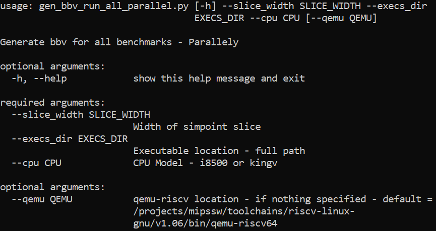
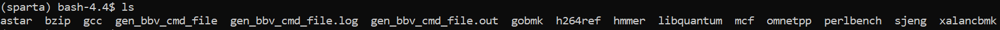

### Description
gen_bbv.py --- Generates bbvs for a benchmark
gen_bbv_run_all_parallel.py --- Generates bbvs for all benchmarks using GNU parallel tool

### How to run

- Make sure you are in ```sparta``` environment

    Scripts will run on mipscs812, mipscs813

    ```bash```

    ```conda activate sparta```

- Run gen_bbv_run_all_parallel.py in directory where you want the bbvs

    

- After a successful run, the directory would look like this 
    

- GNU parallel creates .log .out files for the run

- The .bbv files are located in sub directories Ex - astar/rivers/astar_100m.bbv